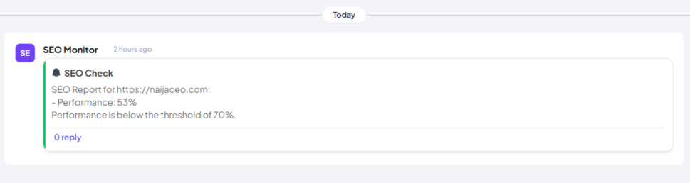

# Telex SEO Monitoring Integration

This integration monitors a website for SEO issues using Google PageSpeed Insights and posts a report to a Telex channel at a scheduled interval.

## Setup Instructions

1.  **Prerequisites:**
    *   A Google Cloud account with the PageSpeed Insights API enabled.
    *   An API key for the PageSpeed Insights API.
    *   A Telex account and a Telex channel.
    *   Node.js (v16 or higher)

2.  **Environment Variables:**
    Set the following environment variable:

    *   `GOOGLE_API_KEY`: Your Google PageSpeed Insights API key.

3   **Installations:**
    1. Clone the repository:
    ```bash
    git clone https://github.com/your-username/your-repo.git
    cd your-repo
    
    2. npm install 
        
4.  **Hosting the `integration.json`:**
    1. You can host using any hosting provider of your choice 

5.  **Adding the Integration to Telex:**
    1.  In Telex, go to your organization's apps page.
    2.  Click "Add New Integration."
    3.  Enter your root URL/  `integration.json`.
    4.  Follow the prompts to install the integration in a Telex channel.

## Usage Instructions

Once the integration is installed, configure the following settings On Telex or from the backend:

*   `site`: The URL of the website to monitor.
*   `interval`: How often to run the SEO check (using cron syntax). For example, `0 * * * *` runs the check every hour.

## Test Cases
This section provides examples of how the SEO Monitoring integration works with different settings.
**Test Case 1: Successful SEO Check**

*   **Settings:**
    *   `site`: `https://www.example.com`
    *   `interval`: `0 * * * *` (Every hour)
    *   `performanceThreshold`: `70`
    *   `brokenLinksLimit`: `5`
    *   `slowPagesLimit`: `3`

*   **Expected Output (in Telex Channel):**
    See Screenshot Below
## Screenshot

